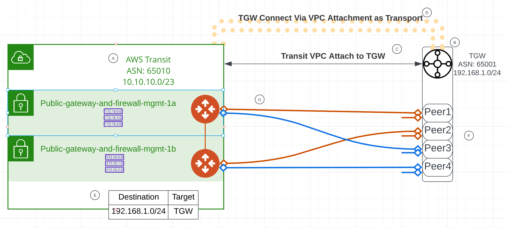
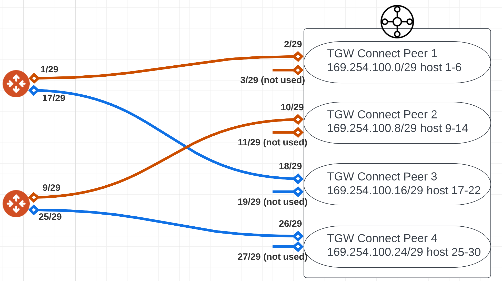
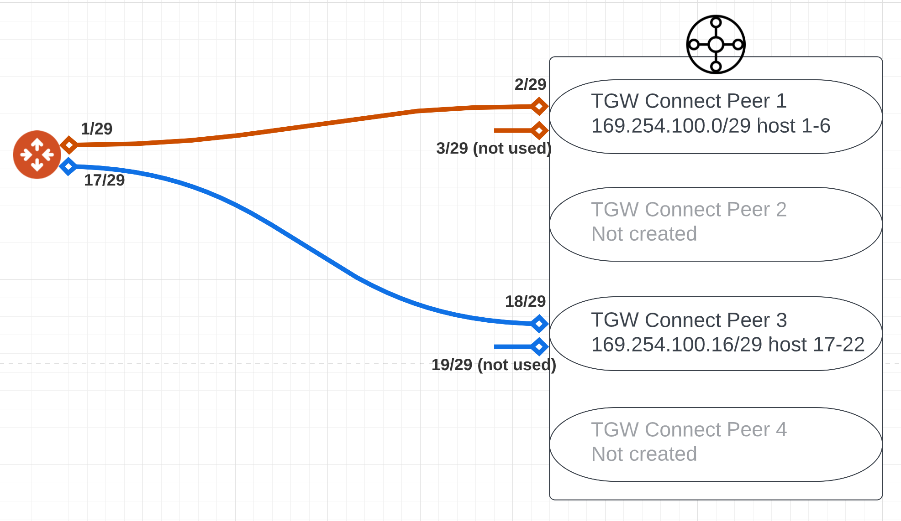
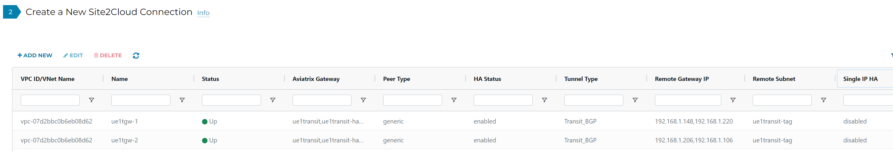
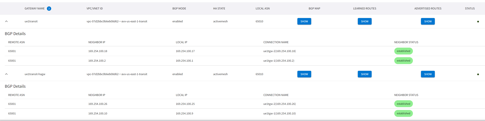
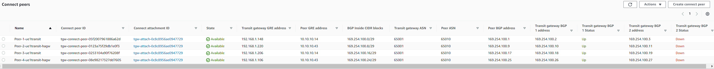

# terraform-aviatrix-bgp-over-gre-between-new-tgw-avx-transit

This module builds BGP over GRE tunnels between existing Aviatrix Transit Gateways and TGW in the same region

Last tested on:
- Terraform v1.2.8
- AWS Provider 4.0
- Aviatrix Provider: 2.23.0
- Aviatrix Controller: 6.8.1149

## Prerequisites

- Lookup https://registry.terraform.io/providers/AviatrixSystems/aviatrix/latest/docs/guides/release-compatibility for aviatrix provider version that's compatiable with your controller version
- Use following providers.tf
```terraform
terraform {
  required_providers {
    aws = {
      source  = "hashicorp/aws"
      version = "~> 4.0"
    }
    aviatrix = {
      source = "AviatrixSystems/aviatrix"
      version = "~> <aviatrix-provider-version>"
    }
  }
}

# Configure the AWS Provider
provider "aws" {
  region = <aws-region>
}
```

## Example variables
```
gw_name="ue1transit"
aws_tgw_asn_number = 65100
aviatrix_transit_gateway_route_table_names = ["aviatrix-ue1transit"]
aviatrix_transit_gateway_vpc_public_subnet_name_contains = "Public-gateway-and-firewall-mgmt"
BGP_inside_CIDR_ranges_27 = ["169.254.100.0/27","169.254.200.0/27"]
```
Since this example gives two /27 BGP inside CIDR ranges, two AWS Connect will be created and four Aviatrix Site to Cloud connections will be created. This is helpful to establish more GRE tunnels to increase throughput.

## Steps taken
  
- Step A: Retrieve Aviatrix Transit VPC and Transit Gateways, retrieve/validate ASN, BGP_ECMP
- Step B: Retrieve AWS TGW, retrieve/validate CIDR (For GRE outer IPs), ASN, Name tag
- Step C: Create AWS TGW VPC Attachment to Aviatrix Transit VPC
- Step D: Create one AWS TGW Connect using VPC Attachment as transport for each BGP_inside_CIDR_ranges_27 provided
- Step E: In Aviatrix Transit VPC, modify subnet Public-gateway-and-firewall-mgmt-1x route table, for TGW CIDR destination, point to TGW
- Step F: In each AWS TGW Connect, maxium 4 peers can be created.
  - When Avx Transit GW HA is enabled, create four peers:
    - First peer point to Aviatrix Primary Transit GW LAN IP as Peer GRE (outer address)
    - Second peer point to Aviatrix HA Transit GW LAN IP as Peer GRE (outer address)
    - Third peer point to Aviatrix Primary Transit GW LAN IP as Peer GRE (outer address)
    - Fourth peer point to Aviatrix HA Transit GW LAN IP as Peer GRE (outer address)
    - See below for inner address explaination
  - When Avx Transit GW HA is disabled, peer 1 and peer 3 will be created:
    - First peer point to Aviatrix Primary Transit GW LAN IP as Peer GRE (outer address)
    - Third peer point to Aviatrix Primary Transit GW LAN IP as Peer GRE (outer address)
- Step G: In Aviatrix Transit, create two external connections for each BGP_inside_CIDR_ranges_27 provided
  - Do not use Enable Remote Gateway HA
  - Over Private Network is enabled
  - When Avx Transit GW HA is enabled:
    - First connection use TGW Peer1 and Peer2's outer BGP address (192.168.1.x in this example) as Remote Gateway IP (Orange lines)
    - Second connection use TGW Peer3 and Peer4's outer BGP address (192.168.1.x in this example) as Remote Gateway IP (Blue lines)
    - See below for inner address explaination
  - When Avx Transit GW HA is disabled:
    - First connection use TGW Peer1's outer BGP address (192.168.1.x in this example) as Remote Gateway IP (Orange lines)
    - Second connection use TGW Peer3's outer BGP address (192.168.1.x in this example) as Remote Gateway IP (Blue lines)


## GRE tunnel Inner IPs
### When Aviatrix Transit GW HA is enabled


### When Aviatrix Transit GW HA is disabled
  

* For each AWS TGW Connect Peer (Using GRE), TGW is looking for a single remote GRE peer outer address. TGW will assign two GRE outer address for each Connect Peer. TGW also require a /29 block for it's BGP Inside CIDR blocks. within the block, TGW assign first IP for remote peer inside IP, and assign 2nd and 3rd IP for it's own inside IP.
* Aviatrix Transit Gateway Site to Cloud Connection always uses it's primary and HA Transit Gateway's LAN IP as GRE outer address. As shown below, the two orange lines indicate one Site to Cloud connection. It will use TGW Connect Peer1/Peer2's CIDR (192.168.1.x/24 in this example) as outer GRE peer address. It will use the first IP of each /29 space range as it's local inner tunnel IP, and second IP of each /29 space range as it's remote inner tunnel IP.


From example above, from TGW it need to build 4 peers to Aviatrix Transit Gateways.
Each peer need it's /29 range, hence we've got 169.254.100.0/29, 169.254.100.8/29, 169.254.100.16/29, 169.254.100.24/29 for these four peers.
For each /29 range, we pick first IP for Aviatrix Transit side inner IP and second IP for TGW side inner IP, and use /30 on Aviatrix Transit Gateway Site to Cloud (S2C) connections.

Since Aviatrix build S2C from both it's gateways, in the above diagram. Orange lines will be one S2C connection and Blue lines will be another S2C connection.

### For Aviatrix Orange S2C connection:
* Local tunnel IP: 169.254.100.1/29,169.254.100.9/29
* Remote tunnel IP: 169.254.100.2/29,169.254.100.10/29

### For Aviatrix Blue S2C connection:
* Local tunnel IP: 169.254.100.17/29,169.254.100.25/29
* Remote tunnel IP: 169.254.100.18/29,169.254.100.26/29

### For AWS TGW Peer 1
* BGP Inside CIDR: 169.254.100.0/29

### For AWS TGW Peer 2
* BGP Inside CIDR: 169.254.100.8/29

### For AWS TGW Peer 3
* BGP Inside CIDR: 169.254.100.16/29

### For AWS TGW Peer 4
* BGP Inside CIDR: 169.254.100.19/29


## Example Aviatrix side status
Site to Cloud connection shows outer IP configuration
  
CoPilot Cloud Routes -> BGP Info shows inner IP configuration
  

## Example AWS TGW Connect Peer Status
Notice each peer, second BGP peering is not been used



# Estimated cost
```
 Name                                                             Monthly Qty  Unit            Monthly Cost

 aws_ec2_transit_gateway_vpc_attachment.tgw_to_avx_transit_vpc
 ├─ Transit gateway attachment                                            730  hours                 $36.50
 └─ Data processed                                              Monthly cost depends on usage: $0.02 per GB

 OVERALL TOTAL                                                                                       $36.50
 ```